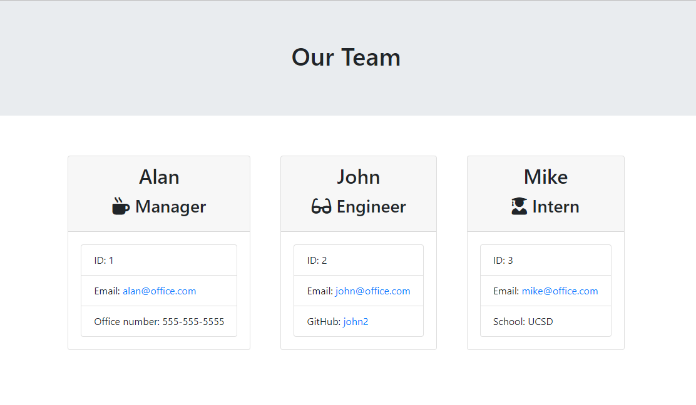

# My-Team-Profile-Generator

 

A Node console application that uses inquirer and takes in information about employees and generates an HTML webpage that displays summaries for each person.

## Installation

1. Download or clone repository
2. Node.js is required to run the application
3. `npm install` to install the required npm packages

## Usage

* Application will be invoked by using the following command:
  
  `node app.js`

* The user will be prompted for information to select employee type
  * Manager (only one is allowed to be added)
  * Engineer (any number)
  * Intern (any number)
  
* All employee will be asked the following information, all prompts are validated to ensure appropriate input to generate the correct output
  * Name
  * ID
  * Email

* Depending on employee role, additional prompts are presented
  * Manager - office number
  * Engineer - GitHub username
  * Intern - school
  
* Then a team.html page will be generated in the output directory, that displays a nicely formatted team roster.
  
* This is a sample page for a project generated using this application
  
  
  
* [Video Demo](https://drive.google.com/file/d/1HKdOMgt5l031SUxf4brJPzKaayeMDJi1/view?usp=sharing)

## Features

* JavaScript
* Node.js
* jest
* npm

## License
  
  Licensed under the [MIT](LICENSE) license.
